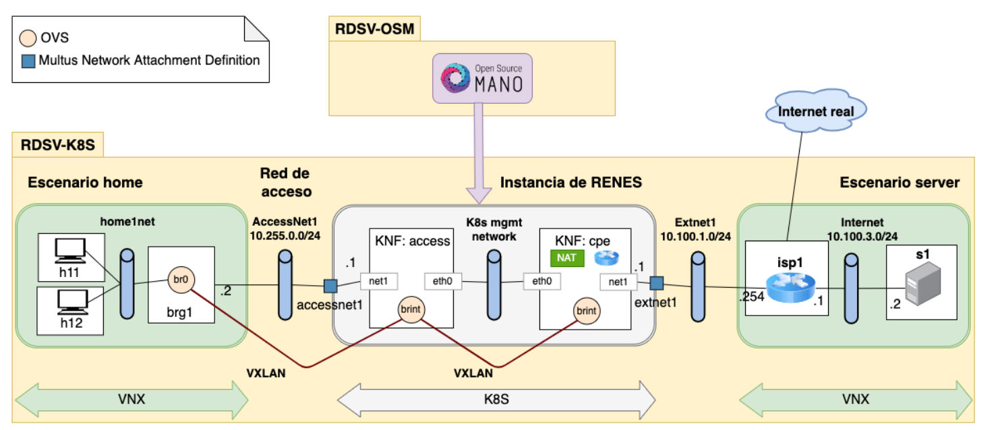
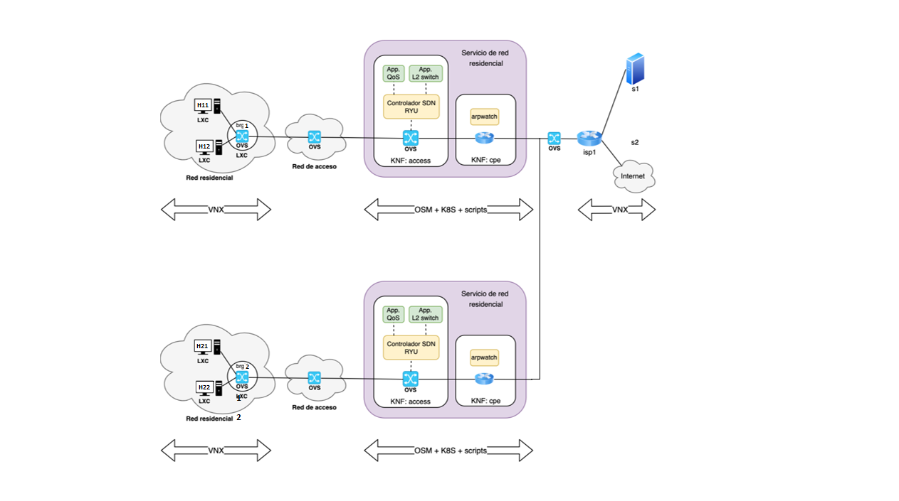

RDSV/SDNV - MUIRST - MUIT

2023

Miguel Ángel Cuesta Bravo, Laura Fernández Galindo & José Javier Mata de la Fuente

# Trabajo Final

## Situación inicial del proyecto <a name="crearvmlocal"></a>

In this section, an overview of the project is provided, both in terms of content and development. Firstly, the studied network service is the residential Internet access service, where the residential router is replaced by a "Bridged Residential Gateway (BRG)" that performs level 2 switching of user traffic between the residential network and the local central office. The rest of the functions are performed in the local central office using network virtualization techniques (NFV), creating a virtual CPE service (vCPE) managed through the orchestration platform.

For its implementation, the virtual image RDSV2022-v1.ova has been used, which virtualizes RDSV-K8S, allowing the use of the microk8s package, the VNX tool, Open vSwitch (ovs); and RDSV-OSM, which installs the OSM environment, which can be accessed graphically. The first image shows the initial scenario of the practice without any changes:




The scenario to be deployed consists of two residential networks as shown in the image. These have IPv4 connectivity from each of the residential networks to the Internet. They use double NAT: on KNF:cpe and on isp1. As can be seen, the KNF:access switch has been replaced by one controlled by OpenFlow and QoS will be managed on the access network using the RYU REST API. In addition, on the KNF:cpe switch, ARP traffic capture has been enabled using arpwatch.




### Setting up the stages 
The scenarios must first be installed on two different computers with different accounts.

On pc-k8s it runs:
```console
/lab/rdsv/get-osmlab2 RDSV-K8S l060
```

In pc-osm it is executed.
```console
/lab/rdsv/get-osmlab2 RDSV-OSM l059
```
<sub> In both cases lxx will be the identifier of each computer.</sub>
<sub> Most instructions will be executed in RDSV-OSM except when specified in the RDSV-K8 hosts or the RDSV-K8 machine is specified.</sub>
### Deployment of the new scenario  
To start deploying the scenarios, the repository must be cloned on both machines:
```console
git clone https://github.com/prdsv/practica.git
```
It must be moved to the repository folder:
```console
cd practica
```
permissions.sh is given permissions and executed, making all downloaded scripts have the necessary permissions.
```console
chmod 777 permisos.sh
```
```console
./permisos.sh
```
In RDSV-K8S, the scenario for this is deployed:
```console
. ./deployk8.sh
```
In RDSV-OSM the complete scenario can be deployed by performing:
```console
cd rdsv-final

. ./deploy.sh
```

To provide connectivity to the residential network 1 and to be able to access its Ips is carried out.

```console
. ./osm_renes1.sh
```
To display the ips of the hosts, the following is done:
```console
ifconfig eth1
```
If it will fail the command is done:
```console
sudo dhclient eth1
ifconfig
```


To check that there is an Internet connection, the following is done:
```console
ping 8.8.8.8
```
<sub> The same process is carried out for the second residential network but running. ./osm_renes2.sh</sub>
# Ryu: controlling the quality of service
## Setting up the first residential network::
For the first residential network to meet the QoS conditions which are: a limit of 12Mbps downstream and 6Mbps upstream. And for the hosts in the case of h11 8Mbps downstream and 4Mbps minimum upstream and h12 4Mbps maximum downstream and 2Mbps maximum upstream, it is executed to configure the downstream conditions:

```console
. ./renes1qosdown.sh
```
And for the conditions of ascent:
```console
. ./renes1qosup.sh
```
To test that the downstream configuration on the hosts has been done properly, it is executed:
```console
iperf3 -s -i 1 -p 5002
```
To send traffic you first access KNF:cpe and do so:
```console
kubectl -n $OSMNS exec -it $CPEPOD -- /bin/bash
iperf3 -c 192.168.255.2x -p 5002 -u -b 20M 1200
```
To test that the upload configuration has been done correctly, first access KNF:cpe and perform it:
```console
kubectl -n $OSMNS exec -it $CPEPOD -- /bin/bash
iperf3 -s -i 1 -p 5002
```
In the hosts it is done:
```console
iperf3 -c 192.168.255.1 -p 5002 -u -b 20M 1200
```
## Configuration of the second residential network:
In order to provide connectivity to the residential network 2 and to be able to access its Ips, this is done:
```console
. ./osm_renes2.sh
```
To display the ips of the hosts, the following is done:
```console
ifconfig eth1
```
If it will fail the command is made:
```console
sudo dhclient eth1
ifconfig
```
To check that there is an Internet connection, the following is done:
```console
ping 8.8.8.8
```
On the other hand, for the second residential network to meet the QoS conditions which are: a limit of 12Mbps downstream and 6Mbps upstream. And for the hosts in the case of h11 8Mbps downstream and 4Mbps minimum upstream and h12 4Mbps maximum downstream and 2Mbps maximum upstream, it is executed to configure the downstream conditions:

```console
. ./renes2qosdown.sh
```
And for the conditions of ascent:
```console
. ./renes2qosup.sh
```
On the RDSV-K8S machine, iperf is installed on all hosts via:
```console
chmod 777 iperf.sh

. ./iperf.sh
```
To test that the downstream configuration on the hosts has been done properly, it is executed:
```console
iperf3 -s -i 1 -p 5002
```
To send traffic you first access KNF:cpe and do so:
```console
kubectl -n $OSMNS exec -it $CPEPOD2 -- /bin/bash

iperf3 -c 192.168.255.2x -p 5002 -u -b 20M 1200
```
To test that the upload configuration has been done correctly, first access KNF:cpe and perform it:
```console
kubectl -n $OSMNS exec -it $CPEPOD2 -- /bin/bash

iperf3 -s -i 1 -p 5002
```
In the hosts it is done:
```console
iperf3 -c 192.168.255.1 -p 5002 -u -b 20M 1200
```
## Capture ARP traffic using "arpwatch".

### Capturing ARP traffic using "arpwatch" on the first residential network
In order to capture ARP traffic using arpwatch on residential network 1, access KNF:cpe and perform pings:

```console
kubectl -n $OSMNS exec -it $CPEPOD -- /bin/bash 
```
And traffic capture is performed:
```console
. ./arpwatch.sh
```
And pings are made to populate the tables, on the one hand within KNF:cpe to log net1 traffic:

```console
ping -c5 10.100.1.254
```
And in h11 or h12:

```console
ping -c5 192.168.255.2x

#Other an Ip that is not in the residential network

ping -c5 192.168.255.30
```
The traffic capture process stops:
```console
/etc/init.d/arpwatch stop
```
And you can see the traffic captured on the net1 and brint interfaces:
```console
cat net1.dat
cat brint.dat
```
### Capturing ARP traffic using "arpwatch" on the second home network
In order to be able to capture ARP traffic using arpwatch on residential network 2, access KNF:cpe and perform pings:

```console
kubectl -n $OSMNS exec -it $CPEPOD2 -- /bin/bash 
```
And traffic capture is performed:
```console
. ./arpwatch.sh
```
And pings are made to populate the tables, on the one hand within KNF:cpe to log net1 traffic:

```console
ping -c5 10.100.1.254
```
Y en h21 o en h22:

```console
ping -c5 192.168.255.2x

#Other an Ip that is not in the residential network

ping -c5 192.168.255.30
```
The traffic capture process is stopped:
```console
/etc/init.d/arpwatch stop
```
And you can see the traffic captured on the net1 and brint interfaces:
```console
cat net1.dat
cat brint.dat
```
